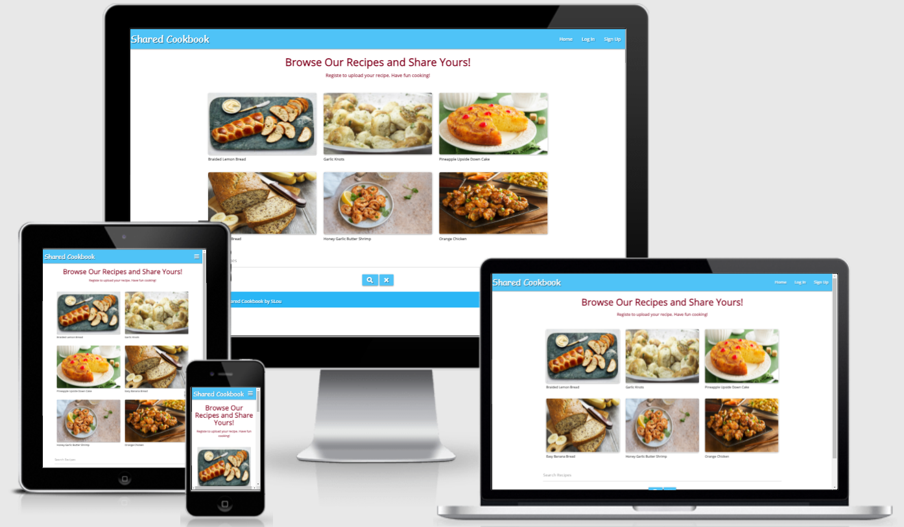
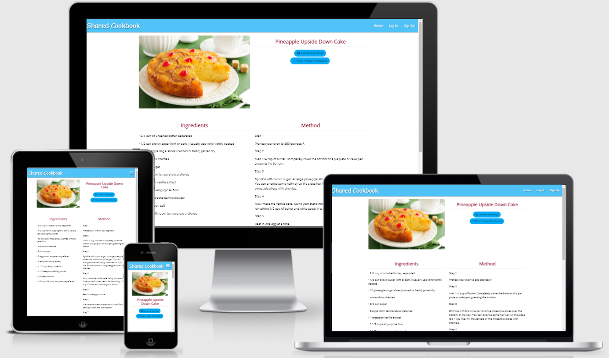
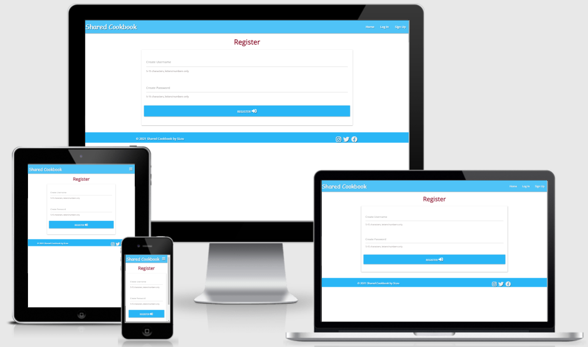

## Backend Development Milestone Project 3 - Shared Cookbook
Shared Cookbook is a recipe website for people who loves cooking and enjoys sharing recipes. 

The website is design to inspire people for sharing their recipes to everyone.

The website can be access by here.

## UX

### As a user
- I can have a brief glance of the recipe cards with images in the home page.
- I can navigate through different pages.
- I can search for recipes.
- I can register to the site.
- After I registered I can add, edit and delete my own recipes.

### As a website owner
- I want the website to be simple to use.
- I want the users to find it easy to share their own recipes.

### Responsive design
User can browse this website on different devices.

## Wireframes 

## Features

### Existing Features

### Future Features

## Technologies Used

- [HTML5](https://en.wikipedia.org/wiki/HTML5) - used for project development 
- [CSS3](https://en.wikipedia.org/wiki/Cascading_Style_Sheets) - used for custome styling the elements.
- [GidPod](https://www.gitpod.io/) - used online IDE for project development, code writing and editing
- [Gidhub](https://github.com/) - used for project repository and version control
- [Bootstrap 4](<https://en.wikipedia.org/wiki/Bootstrap_(front-end_framework)>) - used it's library templates for navbars, buttoms and form.
- [Google Chrome Dev Tools](https://developers.google.com/web/tools/chrome-devtools) - used throughout project development for checking the responsiveness and debugging.
- [Reponsive Design Checker](https://responsivedesignchecker.com/) 
- [Figma](https://www.figma.com/) for creating project wireframes.
- [Fontawesome](https://fontawesome.com/) - used for providing social media icons.
- [Javascript](https://www.javascript.com/) - used for scripts of Google map and contact form.
- [EmailJS](https://www.emailjs.com/) - used for emails.
- [Photo resize](https://www.photoresizer.com/) 
- [Photo collage](https://www.photocollage.com/) 
- [Photo resize](https://www.img2go.com/convert-image-to-image)
- [Photo enlarger](https://www.photoenlarger.com/)

## Testing

### Code Validation
- HTML code was validated on [W3C Validator](https://validator.w3.org/nu/#textarea). Errors were corrected.

- CSS stylesheet was validated on [W3C Validator](https://validator.w3.org/nu/#textarea). No error found.

- Javascript files were validated on [JSHint](https://jshint.com/). No error found.

### Responsiveness
Responsiveness of the site was tested using [Chrome devtools](https://developers.google.com/web/tools/chrome-devtools) and [Responsive design](http://ami.responsivedesign.is/#)

### Browser Compatibility

### Testing User Stories
#### As a user

    
#### As a website owner

### Bugs

## Deployment

## Credits

### Content

### Code

### Media

### Acknowledgements

- I would like to thank my mentor [Precious Ijege](https://www.linkedin.com/in/precious-ijege-908a00168/) for his support, help, patience and encouragements. I am also grateful for the helps from tutors and slack members.
