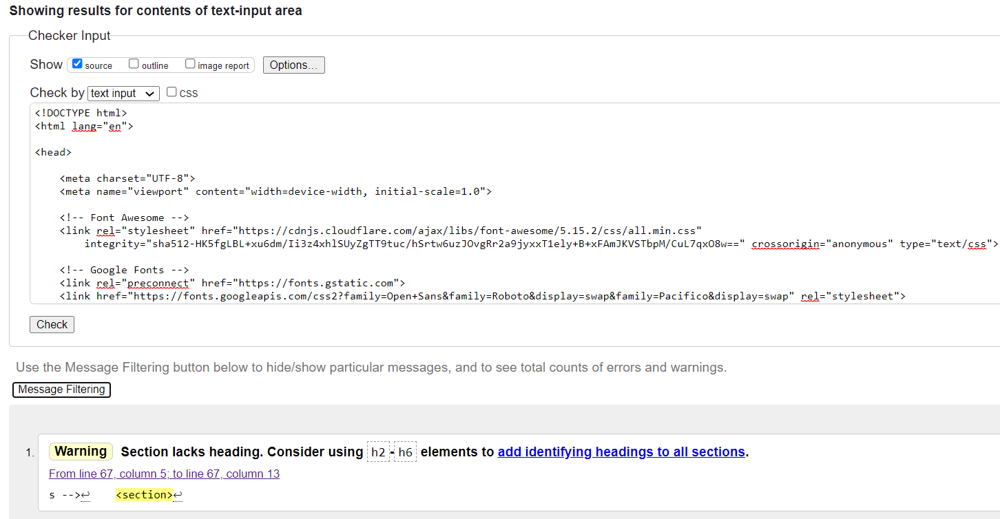
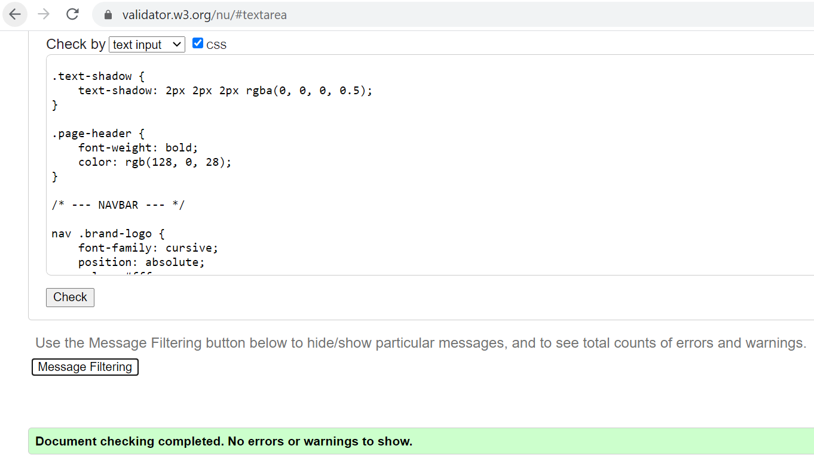
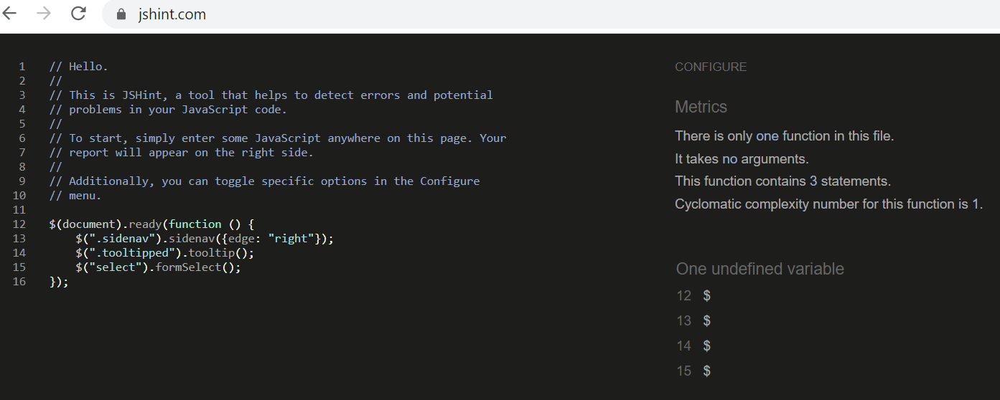
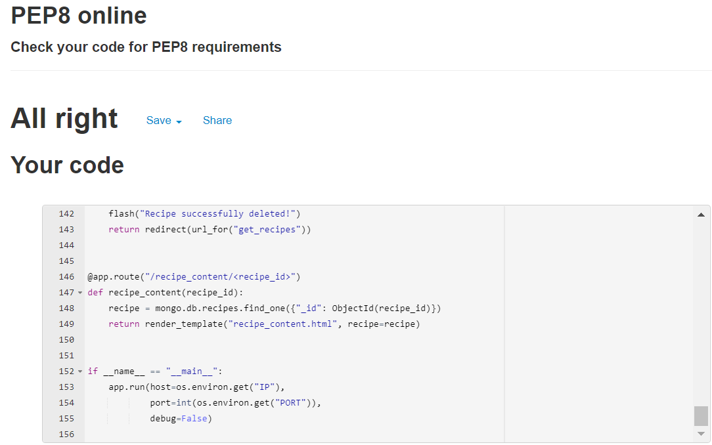
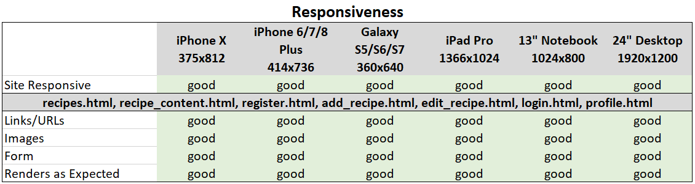
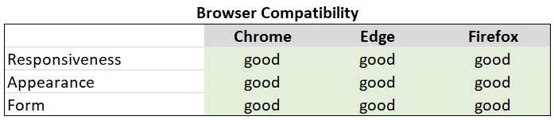
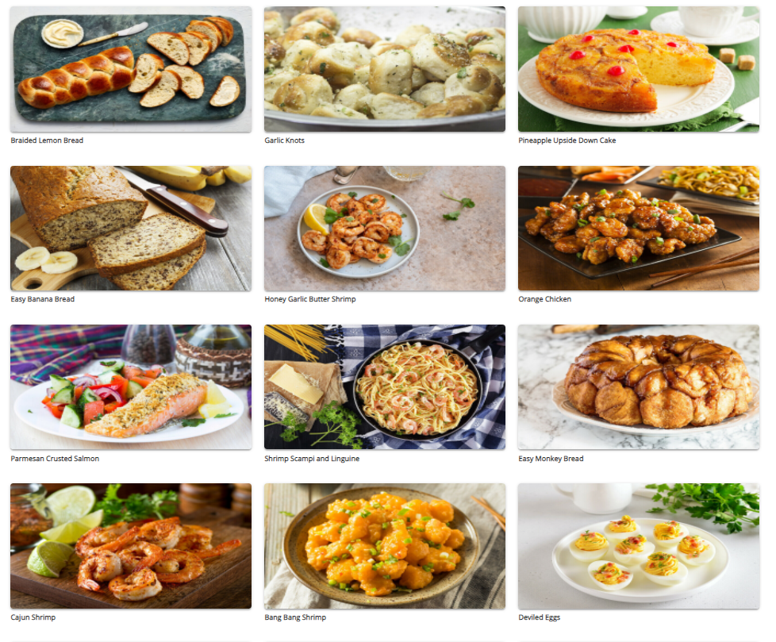
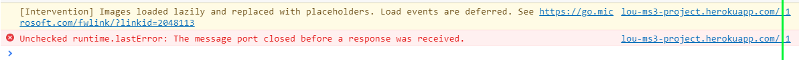

## Backend Development Milestone Project 3 - Shared Cookbook
Shared Cookbook is a recipe website for people who loves cooking and enjoys sharing recipes. 

The website is design to have a place to save my favarite recipes and inspire people for sharing theirs too.

The website can be access [here](http://lou-ms3-project.herokuapp.com/get_recipes).

## UX

### As a user
- I can visit the website on a desktop, a laptop or a smartphone.
- I can have a visual overview of what the website offered when home page opened.
- I can search for recipes.
- I can easily access recipe content.
- I can signup/register or sign out to the website.
- I can add, edit and delete my own recipes once signed in.

### As a website owner
- I want this website to be clean, simple and straight forward.
- I want to store my favarite recipe here.
- I can manage all the recipes of my site including editing and deleting user's recipes.
- I want users to enjoy cooking and share their own recipes.

### Responsive design
User can browse this website on different devices.

## Wireframes 

[Wireframes](https://github.com/suping106/milestone3/blob/master/assets/wireframes/MS3_wireframes.pdf)

## Features

### Existing Features
- Navigation to different pages by using the navigation bar
- Recipes can be searched by the search bar.
- Users can registered to creat an account.
- Registered users can have access to their profile and also add, read, edit and delete (CRUD) their recipes.
- Registered users can login and logout their account.

### Future Features
- Add different categories. 
- Add an index.
- Users can delete their own account.

## Technologies Used

- [HTML5](https://en.wikipedia.org/wiki/HTML5) 
- [CSS3](https://en.wikipedia.org/wiki/Cascading_Style_Sheets) 
- [Python](https://www.python.org/)
- [Javascript](https://www.javascript.com/) 
- [GidPod](https://www.gitpod.io/) 
- [Gidhub](https://github.com/) 
- [Heroku](https://id.heroku.com/)
- [Bootstrap 4](<https://en.wikipedia.org/wiki/Bootstrap_(front-end_framework)>) 
- [Materialize CSS](https://materializecss.com/)
- [Flask](https://flask.palletsprojects.com/en/2.0.x/)
- [Jinja](https://jinja.palletsprojects.com/en/2.11.x/)
- [Jquery](https://jquery.com/)
- [Google Chrome Dev Tools](https://developers.google.com/web/tools/chrome-devtools) 
- [Reponsive Design Checker](https://responsivedesignchecker.com/) 
- [Balsamiq](https://balsamiq.com/) 
- [Fontawesome](https://fontawesome.com/) 
- [Google Fonts](https://fonts.google.com/)
- [Werkzeug](https://werkzeug.palletsprojects.com/en/1.0.x/)

## Testing

### Code Validation
- HTML code in each html file was validated on [W3C Validator](https://validator.w3.org/nu/#textarea). No error was found.
Due to the use of jinja templating I got some errors when directly copied the code to validator. With tutor's help I was able to get the source code from Chrome DevTools. No error was found but there is a warning for section lacks heading.

- CSS stylesheet was validated on [W3C Validator](https://validator.w3.org/nu/#textarea). No error found.

- Javascript files were validated on [JSHint](https://jshint.com/). No error found.

- Python validator [PEP8 online](http://pep8online.com/). No error found.

### Responsiveness
Responsiveness of the site was tested using [Chrome devtools](https://developers.google.com/web/tools/chrome-devtools) and [Responsive design](http://ami.responsivedesign.is/#)

### Browser Compatibility
Compatibility of the site was tested on Google Chrome, Microsoft Edge and Firefox.

### Testing User Stories
#### As a user
- I can visit the website on a desktop, a laptop or a smartphone.
    * The website can be access on desktops, laptops and smartphones.
    
    
- I can have a visual overview of what the website offered when home page opened.
    * The recipes give users a quick visual overview
    

- I can search for recipes.
- I can easily access recipe content.
- I can signup/register or sign out to the website.
- I can add, edit and delete my own recipes once signed in.
    
#### As a website owner
- I want this website to be clean, simple and straight forward.
- I want to store my favarite recipe here.
- I can manage all the recipes of my site including editing and deleting user's recipes.
- I want users to enjoy cooking and share their own recipes.

### Bugs

## Unsolved Bugs

- Console error. I couldn't find a solution to solve this error.

## Deployment

## Credits

### Content
All recipes and photos are from [cookingprofessionally.com](https://www.cookingprofessionally.com/)

### Code
I have used the code from Code Institute Task Manager Mini-Project and fellow students's milestone projects as the base of my project.
- [Task Manager Mini Project](https://learn.codeinstitute.net/courses/course-v1:CodeInstitute+DCP101+2017_T3/courseware/9e2f12f5584e48acb3c29e9b0d7cc4fe/054c3813e82e4195b5a4d8cd8a99ebaa/)
- [EasyDinner](http://ms3-easydinner.herokuapp.com/index)
- [Breaktasty](http://ms3-breaktasty.herokuapp.com/)

### Media
All recipe images are from [cookingprofessionally.com](https://www.cookingprofessionally.com/)

### Acknowledgements

- I would like to thank my mentor [Precious Ijege](https://www.linkedin.com/in/precious-ijege-908a00168/) for his support, help, patience and encouragements. I am also grateful for the helps from tutors and slack members.
