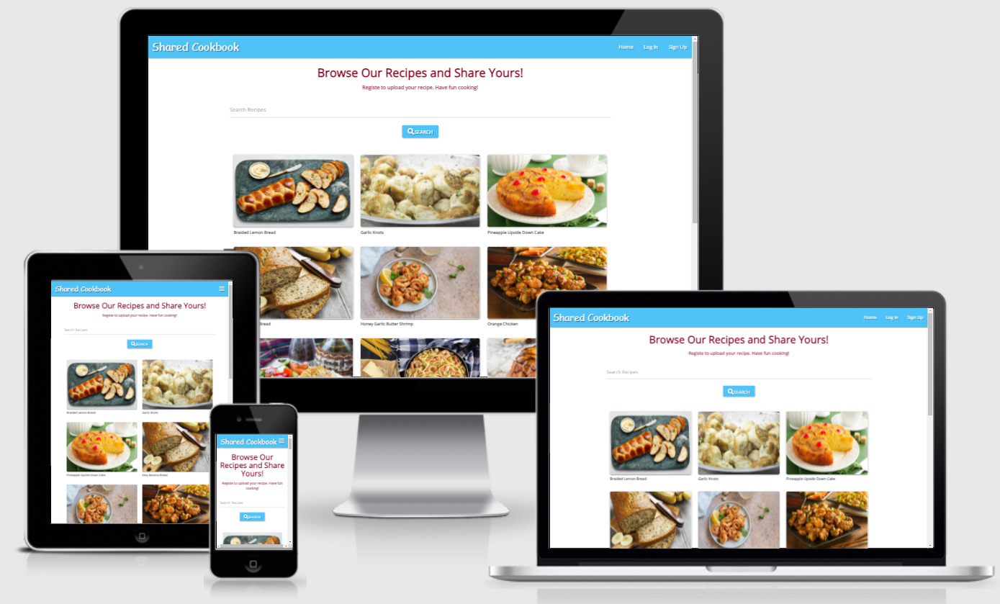

## Backend Development Milestone Project 3 - Shared Cookbook
Shared Cookbook is a recipe website for people who loves cooking and enjoys sharing recipes. 

The website is design to have a place to save my favarite recipes and inspire people for sharing theirs too.

The website can be access [here](http://lou-ms3-project.herokuapp.com/get_recipes).

## UX

### As a user
- I can visit the website on a desktop, a laptop or a smartphone.
- I can have a visual overview of what the website offered when home page opened.
- I can search for recipes.
- I can easily access recipe content.
- I can signup/register or sign out to the website.
- I can add, edit and delete my own recipes once signed in.

### As a website owner
- I want this website to be clean, simple and straight forward.
- I want to store my favarite recipe here.
- I can manage all the recipes of my site including editing and deleting user's recipes.
- I want users to enjoy cooking and share their own recipes.

### Responsive design
User can browse this website on different devices.

## Wireframes 

[Wireframes](https://github.com/suping106/milestone3/blob/master/assets/wireframes/MS3_wireframes.pdf)

## Database Schema

- The database in MongoDB has three collections: categories, recipes and users. Categories collection is for the future use but not used in this project.

- Recipes collection

- Users collection

## Features

### Existing Features
- Navigation to different pages by using the navigation bar
- Recipes can be searched by the search bar.
- Users can registered to creat an account.
- Registered users can have access to their profile and also add, read, edit and delete (CRUD) their recipes.
- Registered users can login and logout their account.

### Future Features
- Add different categories. 
- Add an index.
- Users can delete their own account.

## Technologies Used

- [HTML5](https://en.wikipedia.org/wiki/HTML5) for the structure and the content of the project.
- [CSS3](https://en.wikipedia.org/wiki/Cascading_Style_Sheets) for custome styling the HTML5 elements.
- [Python](https://www.python.org/) for the backend of the project
- [Javascript](https://www.javascript.com/) used as the JavaScript functionality
- [GidPod](https://www.gitpod.io/) for project development, code writing and editing
- [Gidhub](https://github.com/) for project repository and version control
- [Heroku](https://id.heroku.com/) for deploying the app to the cloud platform.
- [Bootstrap 4](<https://en.wikipedia.org/wiki/Bootstrap_(front-end_framework)>) 
- [Materialize CSS](https://materializecss.com/) for the design framework.
- [Flask](https://flask.palletsprojects.com/en/2.0.x/)  for providing libraries, tools and technologies for the app.
- [Jinja](https://jinja.palletsprojects.com/en/2.11.x/) for templating Python.
- [Jquery](https://jquery.com/) for JavaScript functionality
- [Google Chrome Dev Tools](https://developers.google.com/web/tools/chrome-devtools) for checking the responsiveness and debugging.
- [Reponsive Design Checker](https://responsivedesignchecker.com/) 
- [Balsamiq](https://balsamiq.com/) for creating project wireframes.
- [Werkzeug](https://werkzeug.palletsprojects.com/en/1.0.x/) for password hashing, authentication and autohorization.
- [Fontawesome](https://fontawesome.com/) for using the icons in the project.
- [Google Fonts](https://fonts.google.com/) for using the fonts in the project.

## Testing

### Code Validation
- HTML code in each html file was validated on [W3C Validator](https://validator.w3.org/nu/#textarea). No error was found.

    Due to the use of jinja templating I got some errors when directly copied the code to validator. With tutor's help I was able to get the source code from Chrome DevTools. No error was found but there is a warning (same for all html files) for section lacks heading. The warning is from the flash message section in base.html file.

- CSS stylesheet was validated on [W3C Validator](https://validator.w3.org/nu/#textarea). No error found.

- Javascript files were validated on [JSHint](https://jshint.com/). No error found.

- Python validator [PEP8 online](http://pep8online.com/). No error found.

### Responsiveness
Responsiveness of the site was tested using [Chrome devtools](https://developers.google.com/web/tools/chrome-devtools) and [Responsive design](http://ami.responsivedesign.is/#)

### Browser Compatibility
Compatibility of the site was tested on Google Chrome, Microsoft Edge and Firefox.

### Testing User Stories
#### As a user
- I can visit the website on a desktop, a laptop or a smartphone.
    * The website can be access on desktops, laptops and smartphones.
    

- I can have a visual overview of what the website offered when home page opened.
    * The recipes give users a quick overview of all the recipes.
    

- I can navigate through the website.
    * Users can navigate through the website with the navbar on top of the website. Mobile users can use hamburger menu.

- I can search for recipes.
    * Users can use the search bar on the home page to search for recipes by the words in the recipe title or the ingredients.
- I can easily access recipe content.
    * By clicking a recipe card a recipe page will open. Users can see the recipe details.

- I can signup/register or sign out to the website.
    * Users can register to the website by clicking Register link on the Navbar.

- I can add, edit and delete my own recipes once signed in.
    * Once users registered they can 
        1. Log in and log out their account by clicking Log In or Log Out link on the Navbar. 
        2. Share their own recipes by adding them to the website with Add Recipe link on the Navbar.
        3. View their profile page with all the recipes that user uploaded by clicking Profile link on the Navbar.
        4. Edit their own recipes by clicking the Edit buttons underneath the recipe cards.
        5. Delete their own recipes by clicking the Delete buttons underneath the recipe cards.        
    
#### As a website owner
- I want this website to be clean, simple and straight forward.
    * Home page let the users easily navigate through the website. They can open a recipe with a simple click. They can search by typing some keywords and navigate to different pages through the navbar on the top.
     
- I want to store my favarite recipes here.
    * This could be my favarite recipes collection site. I could upload the recipes to the site and easily get an access to it. Users could do the same by uploading their recipes here.
- I can manage all the recipes of my site including editing and deleting user's recipes.
    * Mongo was assigned to be a site manager. Mongo has an access to all the recipes' edit and delete function through the profile page.
     
- I want users to enjoy cooking and share their own recipes.
    * Users can get inspiration from other people's recipes and find the joy of cooking and sharing.

### Bugs

## Unsolved Bugs

- Console error. I couldn't find a solution to solve this error.

## Deployment
- The source code for this project is in GitHub repository.
- The database for the project was created in MongoDB.
- Heroku was used for deploying the app to the cloud platform.

**Clone the project**
- Log in to GitHub
- Locate milestone3 project repository
- Click the green **Code** button 
- Copy the link shown on the popup window under "Clone with HTTPS"
- In Gitpod teminal window make a new directory on your computer
- At the command promt type **git clone** and paste the copied link https://github.com/suping106/milestone3.git
- Press enter to create the local clone

**Working with local copy**
- Install all the requirements.
    * Type in the command in the terminal window: **pip3 install -r requirements.txt**.
- Create the environment variables.
    * Create a **.gitignore** file in the root directory of the project.
    * Add the **env.py** file in the **.gitignore**.
    * Create the file env.py containing following envornment variables.
        - Import os
        - os.environ.setdefault("IP", "Added by developer")
        - os.environ.setdefault("PORT", "Added by developer")
        - os.environ.setdefault("SECRET_KEY", "Added by developer")
        - os.environ.setdefault("MONGO_URI", "Added by developer")
        - os.environ.setdefault("MONGO_DBNAME", "Added by developer")
- Run the app
    * Type **python3 app.py** and run the app.

**Deploying Project To Heroku**
- Set up Heroku 
    * Create a Heroku account 
    * Click **New** button and select **create a new app**
    * Type in **App name** and **Choose a region**
    * Click **Create app** button
- Set up local workspace for Heroku
    * In the command line type **pip3 freeze -- local > requirements.txt** for Heroku to know which filed to install.
    * In the command line type **python app.py > Procfile** for Heroku to know which file is needed as entry point.
- Set up deployment method in Heroku
    * Click **Deploy** tab and select **Connect to GitHub**
    * Copy the project repository name from github and pasted in the search field.
    * When the repo appears click on **Connect** to connect the repository with Heroku
    * Click **Settings** tab and select **Reveal Config Vars** in **Config Vars** section.
    * Enter the values saved in env.py file to these variables below. 
        - IP, PORT, SECRET_KEY, MONGO_URI, MONGO_DBNAME
- Push the requirements.txt and Procfile to repository
    * In the command line of your workspace teminal type following
        - git add requirements.txt
        - git commit -m "add requirements.txt file"
        - git add Procfile
        - git commint -m "add Procfile"
        - git push
- Set up automatic deployment in Heroku
    * Click deploy tab and select **Enable Automatic Deploys** in **Automatic deploys** section.
    * Click **Deploy Branch** and once deployment completed you'll see **Your app was successfully deployed.**
- Open the app in Heroku
    * Click on **Open app** in the top right hand corner. The app will open and the live link is available from the address bar.

## Credits

### Content
All recipes and photos are from [cookingprofessionally.com](https://www.cookingprofessionally.com/)

### Code
I have used the code from Code Institute Task Manager Mini-Project and fellow students's milestone projects as the base of my project.
- [Task Manager Mini Project](https://learn.codeinstitute.net/courses/course-v1:CodeInstitute+DCP101+2017_T3/courseware/9e2f12f5584e48acb3c29e9b0d7cc4fe/054c3813e82e4195b5a4d8cd8a99ebaa/)
- [EasyDinner](http://ms3-easydinner.herokuapp.com/index)
- [Breaktasty](http://ms3-breaktasty.herokuapp.com/)

### Media
All recipe images are from [cookingprofessionally.com](https://www.cookingprofessionally.com/)

### Acknowledgements

- I would like to thank my mentor [Precious Ijege](https://www.linkedin.com/in/precious-ijege-908a00168/) for his support, help, patience and encouragements. I am also grateful for the helps from tutors and slack members.
